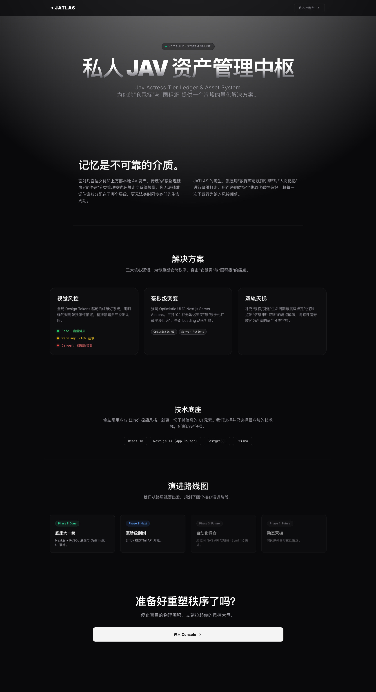
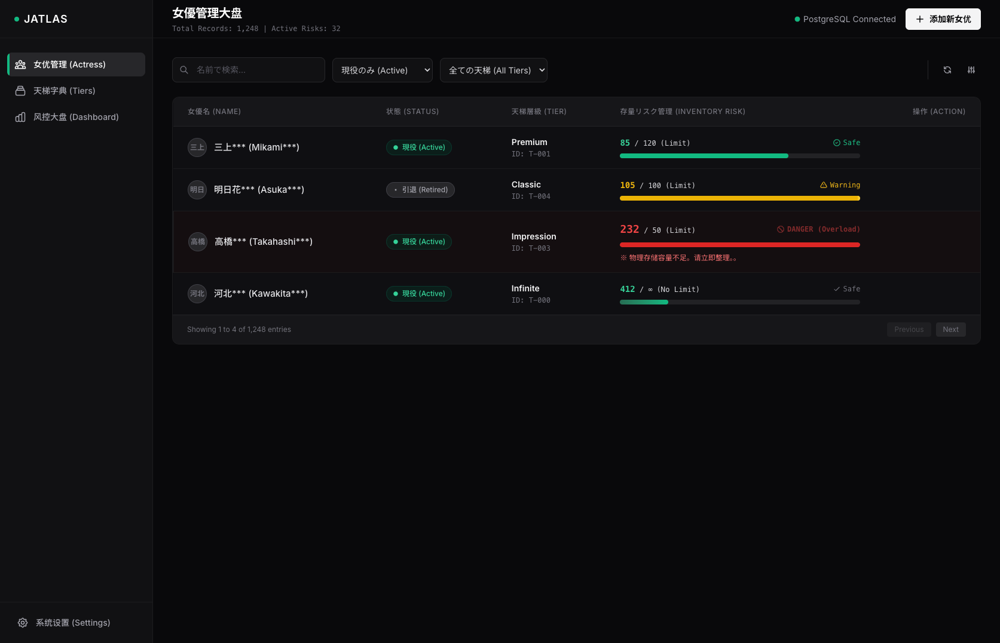

# JATLAS (Jav Actress Tier Ledger & Asset System)

**你的私人数字资产风控大盘与天梯中枢**

## 💡 为什么需要 JATLAS？ (The "Why")

对于拥有近万部本地日本 AV 收藏的“仓鼠党”和“囤积癖”玩家而言，传统的“按物理硬盘+文件夹”分类管理模式必然走向系统熵增：
* **人类记忆的极限**：面对几百位演员，你无法精准记住谁被分配在了哪个层级、存放在哪块硬盘。记忆偏差导致同一个演员的影片散落在多个物理目录中。
* **信息滞后的灾难**：演员从“现役”转为“引退”往往有信息延迟，导致你用现役的规则继续囤积引退的资产，打乱原有的存储逻辑。
* **无意识超载**：只凭感觉下载，缺乏硬性的“水位线”约束，最终导致低优资产挤占高优资产的物理空间。

**JATLAS 的诞生，就是用“规则引擎与强类型数据”对“人肉记忆”进行降维打击。** 结合底层刮削与 JATLAS 的顶层风控，实现对万级影视资产的高效、实时、自动化调仓管理。

---

## 🎯 核心特性 (Core Features)

### 1. 动态水位与视觉风控 (Dynamic Quota Risk Control)
摒弃静态记账，引入动态水位线。系统允许为每个分类设定“建议保存数量”，实时对冲当前的实际影片数，并通过全局 Design Tokens 驱动的红绿灯系统进行强视觉阻断：
* 🟢 **Safe (绿色)**：影片数量在配额内。资产健康。
* 🟡 **Warning (黄色)**：超出配额 10% 以内。触发边缘告警。
* 🔴 **Danger (红色)**：严重超标。必须立即执行“断舍离”物理删片，或提升该演员的天梯层级。

### 2. 毫秒级无极流转 (Optimistic UI & Zero-Latency)
告别传统后台管理系统恼人的 Loading 动画。
JATLAS 深度重构了数据流，全面接入 Next.js Server Actions 与乐观更新（Optimistic UI）。在修改配额或调整层级的瞬间，前端 UI（包括红黄绿警报色）实现 **0.1 秒无延迟突变**，后台静默完成同步。若遇网络异常，系统将执行原子化拦截并平滑回滚，保障绝对的数据一致性。

### 3. 双轨级联字典 (Tier Ledger System)
将资产的主观价值转化为可自定义的层级（Tier）定义，并与演员的生命周期（现役/引退）深度绑定。通过表单的级联选择，实现资产状态与物理存储预期的精准匹配，拒绝一刀切的混乱管理。

### 4. 极致冷峻的工程美学 (Engineering Elegance)
全站采用纯粹的 Next.js 同构架构，摒弃异构拼接。前端落地页呈现极客风 Bento Grid（便当盒）布局，控制台采用冷灰 (Zinc) 极简风格，剥离一切干扰信息的 UI 元素，为你的磁盘整理提供绝对理性的决策环境。

---

## 🛠 技术底座 (Tech Stack)

JATLAS 采用现代化的单体架构（Monolith），兼顾了极高的研发效能与极致的代码可读性：

* **核心框架**: React 18 + Next.js 14 (App Router 模式)。
* **数据流转**: Next.js Server Actions + `useOptimistic` Hook。
* **持久化层**: PostgreSQL (全面抛弃本地 SQLite 妥协，实现开发/生产环境绝对对齐) + Prisma ORM。
* **视觉工程**: Tailwind CSS 3 + shadcn/ui + 全局 Design Tokens 约束。

---

## 🗺 演进路线图 (Roadmap)

* **Phase 1: 核心风控与底座重构 (Done)**
    * 完成基础 CRUD 与动态颜色水位线。
    * 架构大一统：全面迁移至 Next.js + PostgreSQL。
    * 交互升维：落地 Optimistic UI，实现零延迟操作体验。
* **Phase 2: Emby 实时对账引擎 (Next)**
    * 接入 Emby RESTful API。
    * 废弃人工手动录入影片数量，由后端定时或一键抓取 Emby 中演员的 `TotalRecordCount`，实现逻辑看板与物理硬盘的 100% 自动化同步。
* **Phase 3: 物理存储与自动化编排 (Future)**
    * 接入局域网 NAS API，实时监控具体物理硬盘的剩余空间。
    * 基于规则引擎，自动生成指向物理视频文件的“软链接 (Symlink)”。调仓时只变动逻辑层链接，消除海量文件搬运的 I/O 损耗。
* **Phase 4: 动态天梯与喜好变迁雷达 (Future)**
    * 基于时间序列的资产增量分析。当低优先级演员的影片数量出现“异常拉升斜率”时，系统自动预警，提前感知并预判审美倾向的转移。