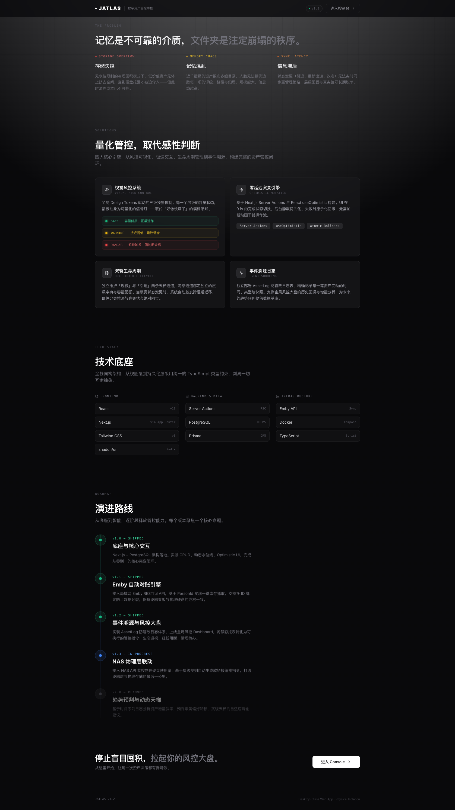

# JATLAS

**Jav Actress Tier Ledger & Asset System — 数字资产管控中枢。**



<div align="center">
  <h3>
    <a href="#-项目介绍">📖 项目介绍</a>
    <span> | </span>
    <a href="#-本地部署">🚀 本地部署</a>
  </h3>
</div>

---

<h2 id="-项目介绍">📖 项目介绍</h2>

JATLAS 专为大规模本地影视收藏设计。用数据库与规则引擎取代人肉记忆，为资产管理建立量化管控体系。

### 核心痛点

| 痛点 | 描述 |
|---|---|
| **存储失控** | 无水位限制的物理囤积模式下，低价值资产无休止挤占空间，直到硬盘报警才被迫介入——但此时清理成本已不可控。 |
| **记忆混乱** | 近千量级的资产散布多级目录，人脑无法精确追踪每一项的评级、路径与归属。规模越大，信息熵越高。 |
| **信息滞后** | 状态变更（引退、重新出道、改名）无法实时同步至管理策略，层级配置与真实偏好长期脱节。 |

### 核心引擎

**1. 视觉风控系统 (Visual Risk Control)**

全局 Design Tokens 驱动的三级预警机制。每一个层级的容量状态都被抽象为可量化的信号灯——取代「好像快满了」的模糊感知。

* 🟢 **SAFE** — 容量健康，正常运作
* 🟡 **WARNING** — 接近阈值，建议调仓
* 🔴 **DANGER** — 超载触发，强制断舍离

**2. 零延迟突变引擎 (Optimistic Mutation)**

基于 Next.js Server Actions 与 React `useOptimistic` 构建。UI 在 0.1s 内完成状态切换，后台静默持久化。失败时原子化回滚，无需加载动画干扰操作流。

**3. 双轨生命周期 (Dual-Track Lifecycle)**

独立维护「现役」与「引退」两条天梯通道，每条通道绑定独立的层级字典与容量配额。当演员状态变更时，系统自动触发跨通道迁移，确保分类策略与真实状态绝对同步。

**4. 事件溯源日志 (Event Sourcing)**

独立部署 `AssetLog` 防篡改日志表，精确记录每一笔资产变动的时间、类型与快照。支撑全局风控大盘的历史回溯与增量分析，为未来的趋势预判提供数据基底。


*(JATLAS v1.2 全局风控大盘)*


*(资产控制台与动态水位线)*

### 技术底座

| 层级 | 技术 |
|---|---|
| **Frontend** | React 18, Next.js 14 (App Router), Tailwind CSS 3, shadcn/ui |
| **Backend & Data** | Server Actions (RSC), PostgreSQL, Prisma ORM |
| **Infrastructure** | Emby API (Sync), Docker Compose, TypeScript (Strict) |

### 演进路线

| 版本 | 状态 | 主题 | 内容 |
|---|---|---|---|
| **v1.0** | ✅ Shipped | 底座与核心交互 | Next.js + PostgreSQL 架构落地，实装 CRUD、动态水位线、Optimistic UI。 |
| **v1.1** | ✅ Shipped | Emby 自动对账引擎 | 接入局域网 Emby RESTful API，基于 PersonId 一键库存抓取，多 ID 绑定防数据分裂。 |
| **v1.2** | ✅ Shipped | 事件溯源与风控大盘 | 实装 AssetLog 防篡改日志体系，上线全局风控 Dashboard：生态透视、红线阻断、清理待办。 |
| **v1.3** | 🔵 In Progress | NAS 物理层联动 | 接入 NAS API 监控物理硬盘使用率，基于层级规则自动生成软链接 (Symlink) 编排指令。 |
| **v2.0** | 🔘 Planned | 趋势预判与动态天梯 | 基于时间序列日志分析资产增量斜率，预判审美偏好转移，实现天梯自适应调仓建议。 |

---

<h2 id="-本地部署">🚀 本地部署</h2>

JATLAS 被设计为物理隔离的 Desktop-Class Web App。

### 0. 前置环境
* **Node.js** (v18.17+)
* **PostgreSQL** (Mac 推荐 Postgres.app，开启静默自启)
* **Emby Server** (局域网可达，留空则降级为纯手动记账)

### 1. 克隆与安装
```bash
git clone https://github.com/xfcc/JATLAS.git
cd JATLAS
npm install
```

### 2. 环境变量配置

```bash
cp .env.example .env
```

编辑 `.env` 文件：

```env
# [核心] 数据库连接 (本地 Postgres 实例)
DATABASE_URL="postgresql://用户名:密码@localhost:5432/jatlas?schema=public"

# [可选] Emby 引擎配置 (留空则降级为纯手动记账)
EMBY_SERVER_URL="http://192.168.x.x:8096"
EMBY_API_KEY="你的_EMBY_API_KEY"
```

### 3. 数据底座迁移

```bash
npx prisma migrate dev --name init
```

### 4. 引擎点火

```bash
npm run dev
```

访问 `http://localhost:3000`，风控中枢上线。

> **💡 极客建议 (Mac)**：
> 在项目根目录创建 `start-jatlas.command` 脚本，写入 `cd $(dirname "$0") && npm run dev` 并赋予执行权限 (`chmod +x`)，实现双击一键拉起控制台。
