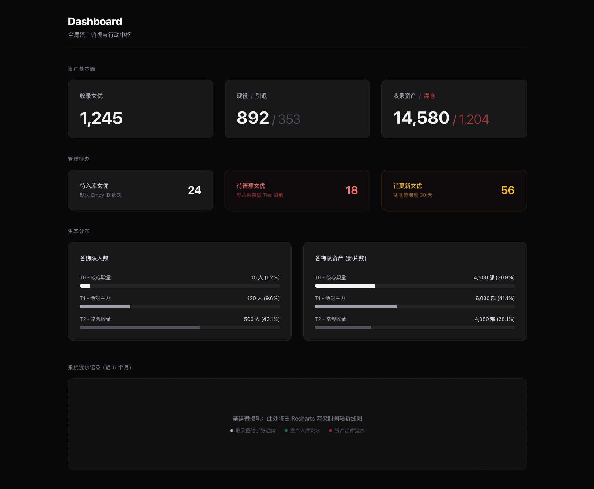

# JATLAS (Jav Actress Tier Ledger & Asset System)

**你的私人成人数字资产风控大盘与天梯中枢**

## 💡 为什么需要 JATLAS？

对于拥有近万部本地视频收藏的“仓鼠党”和“囤积癖”玩家而言，传统的“按物理硬盘+文件夹”分类管理模式必然走向系统熵增：
* **无意识超载**：只凭感觉下载，缺乏硬性的“水位线”约束，最终导致低优资产无休止地挤占高优资产的物理存储空间。
* **人类记忆的极限**：面对数百位女优，你无法精准记住谁被分配在了哪个层级、存放在哪块硬盘。记忆偏差导致同源资产散落在多个物理目录中。
* **信息滞后的灾难**：资产从“现役”转为“引退”往往存在信息延迟，导致你用现役的规则继续囤积引退的资产，打乱原有的存储逻辑。

**JATLAS 的诞生，就是用“规则引擎与强类型数据”对“人肉记忆”进行降维打击。** 结合底层自动化刮削与顶层 Dashboard 风控，实现对万级影视资产的高效、实时、自动化调仓管理。

---

## 🎯 核心特性 (Core Features)

### 1. 全局风控大盘与行动引擎 (Dashboard & Actionable Insights)
摒弃毫无意义的“死报表”，将数据升维为“待办指令”。
* **生态透视**：实时监控各梯队（Tier）的人数与资产占比，防范评级体系通胀。
* **红线阻断**：系统自动揪出“突破物理限额”的爆仓资产与“刮削停滞”的陈旧资产，将静态大盘转化为精准的“断舍离”执行清单。

*(图：JATLAS v1.2 全局风控大盘)*

### 2. Emby 零摩擦自动对账 (Emby Sync Engine)
彻底废弃人工手动录入影片数量的低效模式。
深度集成局域网 Emby RESTful API，基于底层唯一 `PersonId` 实现两段式精准抓取。一键将刮削器中的真实 `TotalRecordCount` 覆写回大盘，实现逻辑看板与物理硬盘的 100% 毫秒级同步。

### 3. 动态水位与乐观流转 (Dynamic Quota & Optimistic UI)
* **视觉风控**：为每个分类设定“建议保存数量”，系统自动对冲实际库存。通过 🟢 安全、🟡 警告、🔴 危险 的全局 Design Tokens 实现强视觉阻断。
* **零延迟体验**：全面接入 Next.js Server Actions 与 `useOptimistic`。在调整配额的瞬间，前端 UI 与进度条实现 **0.1 秒无延迟突变**，后台静默完成同步。

*(图：JATLAS 资产控制台与动态水位线)*

### 4. 极致冷峻的工程美学 (Engineering Elegance)
全站采用纯粹的 Next.js 同构架构，摒弃异构拼接。前端控制台采用冷灰 (Zinc) 极简风格，剥离一切干扰信息的 UI 元素。数据库层引入 **事件溯源 (Event-Sourcing)** 架构，通过 `AssetLog` 独立防篡改日志表，精准记录资产时间轴上的每一笔增删流水。

---

## 🛠 技术底座 (Tech Stack)

JATLAS 采用现代化的单体架构（Monolith），兼顾了极高的研发效能与极致的代码可读性：

* **核心框架**: React 18 + Next.js 14 (App Router 模式)。
* **数据流转**: Next.js Server Actions + `useOptimistic` Hook。
* **持久化层**: PostgreSQL (全面抛弃本地 SQLite 妥协，实现开发/生产环境绝对对齐) + Prisma ORM。
* **底层基建**: 具备防篡改特性的 Event-Sourcing 日志聚合架构。
* **视觉工程**: Tailwind CSS 3 + shadcn/ui + Zinc 暗黑系设计规范。

---

## 🗺 演进路线图 (Roadmap)

* **v1.0: 核心风控与底座重构 (Done)**
    * 完成基础 CRUD 与动态颜色水位线。
    * 落地 Optimistic UI，实现零延迟操作体验。
* **v1.1: Emby 实时对账引擎 (Done)**
    * 接入 Emby API，打通局域网自动化抓取链路。
    * 支持多 ID 绑定防范元数据分裂。
* **v1.2: 资产风控大盘与事件溯源 (Done)**
    * 重构底层写入逻辑，实装 `AssetLog` 日志体系。
    * 上线 Dashboard，实现 M1基本面、M2待办引擎、M3生态分布的可视化指引。
* **v1.3: 自动化物理编排 (Next)**
    * 接入局域网 NAS API，实时监控具体物理硬盘剩余空间。
    * 基于规则自动生成指向物理视频文件的“软链接 (Symlink)”，消除海量文件搬运的 I/O 损耗。
* **v2.0: 审美变迁雷达 (Future)**
    * 基于时间序列与日志流水，分析资产增量斜率。系统自动预警低优先级资产的异常增量，提前预判审美倾向转移。